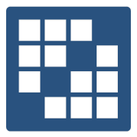

# [https://hub.docker.com/r/ibaiborodine/liferay-portal-ce](https://hub.docker.com/r/ibaiborodine/liferay-portal-ce)
 
Last added tag: [](https://travis-ci.org/igor-baiborodine/docker-liferay-portal-ce)

# Supported tags and respective `Dockerfile` links

-  [`7.1.3-ga4-jdk8-alpine` (*7.1.3-ga4/jdk8-alpine/Dockerfile*)](https://github.com/igor-baiborodine/docker-liferay-portal-ce/blob/6c5790e93cde807e4db349f950a7059cb887f035:6c5790e93cde807e4db349f950a7059cb887f035/7.1.3-ga4/jdk8-alpine/Dockerfile)

# Quick reference

-	**Where to get help**:  
	[the Liferay Community Forums](https://liferay.dev/forums/-/message_boards/category/243728), [the Docker Community Forums](https://forums.docker.com/), [the Docker Community Slack](https://blog.docker.com/2016/11/introducing-docker-community-directory-docker-community-slack/), or [Stack Overflow](https://stackoverflow.com/search?tab=newest&q=docker)

-	**Where to file issues**:  
	[https://github.com/igor-baiborodine/docker-liferay-portal-ce/issues](https://github.com/igor-baiborodine/docker-liferay-portal-ce/issues)

-	**Maintained by**:  
	[Igor Baiborodine](https://github.com/igor-baiborodine)

-	**Supported architectures**: ([more info](https://github.com/docker-library/official-images#architectures-other-than-amd64))  
	amd64

-	**Source of this description**:  
	[repo's `readme/` directory](https://github.com/igor-baiborodine/docker-liferay-portal-ce/tree/master/readme)

-	**Supported Docker versions**:  
	[the latest release](https://github.com/docker/docker-ce/releases/latest) (down to 1.6 on a best-effort basis)

# What is Liferay Portal?

**Liferay Portal** is an open source portal framework for building web applications, websites, and portals. It also offers a CMS and may serve as an enterprise integration platform.  

[https://www.liferay.com/downloads-community](https://www.liferay.com/downloads-community)


 
Logo &copy; Liferay, Inc.

# How to use this image

TODO

# Image Variants

## `ibaiborodine/liferay-portal-ce:<version>-<jdk>`

This is the defacto image. If you are unsure about what your needs are, you probably want to use this one. It is designed to be used both as a throw away container (mount your source code and start the container to start your app), as well as the base to build other images off of.

## `ibaiborodine/liferay-portal-ce:<version>-<jdk>-slim`

This image does not contain the common packages contained in the default tag and only contains the minimal packages needed to run `liferay-portal-ce`. Unless you are working in an environment where *only* the `liferay-portal-ce` image will be deployed and you have space constraints, we highly recommend using the default image of this repository.

## `ibaiborodine/liferay-portal-ce:<version>-<jdk>-alpine`

This image is based on the popular [Alpine Linux project](http://alpinelinux.org), available in [the `alpine` official image](https://hub.docker.com/_/alpine). Alpine Linux is much smaller than most distribution base images (~5MB), and thus leads to much slimmer images in general.

This variant is highly recommended when final image size being as small as possible is desired. The main caveat to note is that it does use [musl libc](http://www.musl-libc.org) instead of [glibc and friends](http://www.etalabs.net/compare_libcs.html), so certain software might run into issues depending on the depth of their libc requirements. However, most software doesn't have an issue with this, so this variant is usually a very safe choice. See [this Hacker News comment thread](https://news.ycombinator.com/item?id=10782897) for more discussion of the issues that might arise and some pro/con comparisons of using Alpine-based images.

To minimize image size, it's uncommon for additional related tools (such as `git` or `bash`) to be included in Alpine-based images. Using this image as a base, add the things you need in your own Dockerfile (see the [`alpine` image description](https://hub.docker.com/_/alpine/) for examples of how to install packages if you are unfamiliar).

# License

**This library, Liferay Portal Community Edition, is free software ("Licensed Software"); you can redistribute it and/or modify it under the terms of the GNU Lesser General Public License as published by the Free Software Foundation; either version 2.1 of the License, or (at your option) any later version.**

**This library is distributed in the hope that it will be useful, but WITHOUT ANY WARRANTY; including but not limited to, the implied warranty of MERCHANTABILITY, NONINFRINGEMENT, or FITNESS FOR A PARTICULAR PURPOSE. See the GNU Lesser General Public License for more details.**

**You should have received a copy of the GNU Lesser General Public License along with this library; if not, write to:**
```text
Free Software Foundation, Inc. 51 Franklin Street, Fifth Floor Boston, MA 02110-1301 USA
```

As with all Docker images, these likely also contain other software which may be under other licenses (such as Bash, etc from the base distribution, along with any direct or indirect dependencies of the primary software being contained).

As for any pre-built image usage, it is the image user's responsibility to ensure that any use of this image complies with any relevant licenses for all software contained within.
